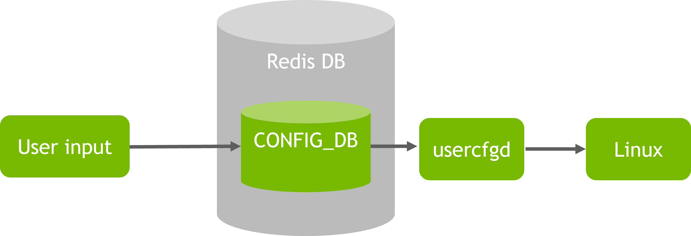
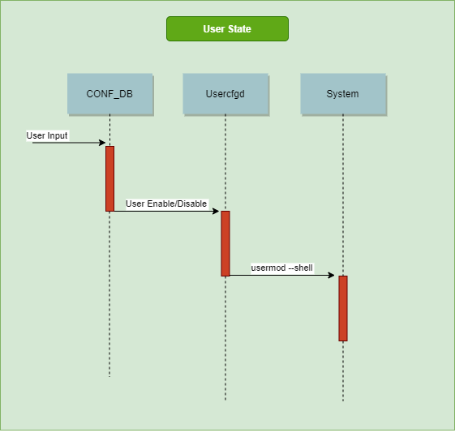

# User Management design #

##  1. Table of Content


* 1. [Table of Content](#TableofContent)
	* 1.1. [Revision](#Revision)
	* 1.2. [Scope](#Scope)
	* 1.3. [Definitions/Abbreviations](#DefinitionsAbbreviations)
	* 1.4. [Overview](#Overview)
	* 1.5. [Requirements](#Requirements)
		* 1.5.1. [Define defaults](#Definedefaults)
		* 1.5.2. [Configurations](#Configurations) 
* 2. [Design](#Design)
	* 2.1. [Architecture Design](#ArchitectureDesign)
	* 2.2. [High-Level Design](#High-LevelDesign)
	* 2.2. [Usercfd Role](#UsercfdRole)
* 3. [Configuration and management](#Configurationandmanagement)
		* 3.1. [ConfigDB Tables](#ConfigDBTables)
		* 3.2. [ConfigDB schemas](#ConfigDBschemas) 
		* 3.3. [CLI/YANG model](#CLIYANGmodel)
* 4. [Build](#Build)
		* 4.1. [Compilation](#Compilation)
		* 4.2. [Feature default](#Featuredefault)
* 5. [Flows](#Flows)
		* 5.1. [Init Flow](#InitFlow)
		* 5.2. [Upgrade Flow](#UpgradeFlow)
		* 5.3. [User add/delete](#UserAddDelete) 
		* 5.4. [User state](#UserState)
		* 5.5. [User full-name](#UserFullName)
		* 5.6. [User role](#UserRole)
		* 5.7. [User hashed-password](#UserHashedPassword)
* 6. [SAI API](#SAIAPI)
* 7. [Warmboot and Fastboot Design Impact](#WarmbootandFastbootDesignImpact)
* 8. [Restrictions/Limitations](#RestrictionsLimitations)
* 9. [Test Plan](#TestPlan)
		* 9.1. [Unit Test cases](#UnitTestcases)


###  1.1. Revision
|  Rev  |  Date   |      Author      | Change Description |
| :---: | :-----: | :--------------: | ------------------ |
|  0.1  | 08/2022 | Mohammed Zayadna | Phase 1 Design     |

###  1.2. <a name='Scope'></a>Scope

This HLD document described the requirements, architecture and configuration details of User Management feature in switches Sonic OS based.

###  1.3. <a name='DefinitionsAbbreviations'></a>Definitions/Abbreviations
Role - capability of user


###  1.4. <a name='Overview'></a>Overview

This document provides high level design for the username mgmt and configuration in Sonic.<br/>
It will define the default role (capabilities), default users and describe the supported configurations
for users.

###  1.5. <a name='Requirements'></a>Requirements
####  1.5.1. <a name='Definedefaults'></a>Define defaults
* Default roles: Configurator and Viewer<br/>
* Default users: admin and monitor
####  1.5.2. <a name='Configurations'></a>Configurations
* **add/delete user**

	Add/Delete a user from system. Default users shouldn't be deleted.<br/>
    Defining the password is mandatory when adding a new user.
* **enable/disable user**

	Control login of the user by enabling/disabling user state.
* **change full-name**

	Change Gecos field (Description) of user
* **change role (capability)**

	Control the capability of user by changing the role
* **change hashed-password**

	Change the password of a user by providing an hashed password
    
##  2 <a name='Design'></a>Design
	
###  2.1 <a name='ArchitectureDesign'></a>Architecture Design


(flow description in the chapter below)

###  2.2 <a name='High-LevelDesign'></a>High-Level Design

Sonic has two main users:  
* Admin: Administrator with limited access rights.It is part of sudo group.<br/>
* Root: Superuser with highest access rights. Login is disabled for this user. 

We will define two roles for users:<br/>
* **Configurator**: User that has permissions to configure the system.<br/>
	Each Configurator user will be part of the following groups:<br/>
	**primary group**: admin<br/>
	**secondary groups**: sudo,docker,redis,adm
    
* **Viewer**: User with monitor permissions only. <br/>
	Each Viewer user will be part of the following groups:<br/>
	**primary group**: adm<br/>
	**secondary groups**: N/A

In addition, we will define two default users:
* **admin**: Configurator user.<br/>
	The only change from the current admin in Sonic is the additional group: adm
    
* **monitor**: Viewer user. <br/>
	User with monitoring capabilities only .<br/>

**Note**:
 Group adm is used for system monitoring tasks. Members of this group can read the files under "/var/log"


###  2.3 <a name='UsercfdRole'></a>Usercfgd Role:

Usercfgd is the daemon that get events from USER_TABLE in CONF_DB and apply the new configuration on the system.<br/>
The new daemon should start running after "config-setup.service" (i.e. after database is ready) but before systemd enables "system-logind.service" (i.e. before user can login to system)<br/>


)<br/>


##  3 <a name='Configurationandmanagement'></a>Configuration and management

###  3.1 <a name='ConfigDBTables'></a>ConfigDB Tables

```
USER_TABLE:{
	"<username>":{
		"state": {{enable/disable}}
		"full-name": {{string}}
		"hashed-password": {{string}}
		"hashed-password_history": {{string}}
		"role": {{Configurator/Viewer}}
	}
}
```

```
ROLE_TABLE:{
	"<role-name>":{
		"primary_group": {{string}}
        "secondary_groups": {{string}}
	}
}
```
###  3.2 <a name='ConfigDBschemas'></a>ConfigDB schemas

```
; Defines schema for User configuration attributes in USER_TABLE:
key                                   = "username"                  ;user configuration
; field                               = value
STATE                                 = "enable" / "disable"        ; user enable/disable
FULL-NAME                             = STRING                      ; Full-name/Description of user
HASHED-PASSWORD                       = STRING                      ; Hashed password
HASHED-PASSWORD_HISTORY               = STRING                      ; List of old passwords (0-99)
ROLE                                  = "Configurator" / "Viewer"   ; Role/Capability 

```

```
; Defines schema for role configuration attributes in ROLE_TABLE:
key                                   = "role name"                  ;Role configuration
; field                               = value
PRIMARY_GROUP                         = STRING       				; Primary linux group
SECONDARY_GROUP                       = STRING                      ; List of secondary linux groups
```

###  3.3 <a name='CLIYANGmodel'></a>CLI/YANG model

##### YANG model
```yang

//filename:  sonic-user_mgmt.yang
module sonic-user_mgmt {
    yang-version 1.1;
    namespace "http://github.com/Azure/sonic-user_mgmt";
	prefix user_mgmt;

    description "User Management YANG Module for SONiC OS";

	revision 2022-08-01 {
        description
            "First Revision";
    }
   container sonic-user_mgmt {

        container USER_MGMT {

            description "USER MANAGEMENT part of config_db.json";

            list USER_MGMT_LIST {

                key "name";
                
                leaf name {
                  type string;
                  description
                    "User name.";
                }                

                leaf state {
                    type string {
                        pattern "enable|disable";
                    }
                }
                
                leaf role {
                    mandatory true;
                    default "configurator";
                    type string {
                        pattern "configurator|viewer";
                    }
                }                
                
                leaf full-name {
                    type string;
                }
                
                leaf hashed-password {
                    mandatory true;
                    type string;
                }
                
                leaf hashed-password_history {
                    type string;
                }
                
               
            } /* end of list USER_MGMT_LIST */

        } /* end of container USER_MGMT */

    } /* end of container sonic-user_mgmt */

} /* end of module sonic-user_mgmt */

```

```yang
//filename:  sonic-role_mgmt.yang
module sonic-role_mgmt {
    yang-version 1.1;
    namespace "http://github.com/Azure/sonic-role_mgmt";
	prefix role_mgm;

    description "Role Management YANG Module for SONiC OS";

	revision 2022-08-01 {
        description
            "First Revision";
    }
   container sonic-role_mgmt {

        container ROLE_MGMT {

            description "ROLE MANAGEMENT part of config_db.json";

            list ROLE_MGMT_LIST {

                key "name";
                
                leaf name {
                  type string;
                  description
                    "Role name.";
                }                

                leaf primary_group {
                    mandatory true;
                    type string;
                  	description
                    	"Primary linux group.";                    
                }
                
                leaf secondary_groups {
                    mandatory true;
                    type string;
                  	description
                    	"List of secondary linux groups.";                    
                }                

               
            } /* end of list ROLE_MGMT_LIST */

        } /* end of container ROLE_MGMT */

    } /* end of container sonic-role_mgmt */

} /* end of module sonic-role_mgmt */

```

##### Config CLI


##### Show CLI

##  4 <a name='Build'></a>Build

###  4.1 <a name='Compilation'></a>Compilation

Both default users will be created during build with the default password, userinfo and will be added to default secondary groups.<br/>
The following variables will be added to "rules/config" file
```
# DEFAULT_USERNAME - default username for installer build
DEFAULT_USERNAME = admin

# DEFAULT_PASSWORD - default password for installer build
DEFAULT_PASSWORD = YourPaSsWoRd

# DEFAULT_ADMIN_USERINFO - default user info of admin user
DEFAULT_ADMIN_USERINFO="Default\ admin\ user,,,"

# CONFIGURATOR_SECONDARY_GROUPS - default secondary groups list for configurator user
CONFIGURATOR_SECONDARY_GROUPS = sudo,docker,redis,adm

# DEFAULT_MONITOR_USERNAME - default monitor username for installer build
DEFAULT_MONITOR_USERNAME = monitor

# DEFAULT_MONITOR_PASSWORD - default monitor password for installer build
DEFAULT_MONITOR_PASSWORD = YourPaSsWoRd

# DEFAULT_MONITOR_USERINFO - default user info of monitor user
DEFAULT_MONITOR_USERINFO="Default\ monitor\ user,,,"

# VIEWER_SECONDARY_GROUPS - default secondary groups list for viewer user
VIEWER_SECONDARY_GROUPS =
```

User can change the default users names or passwords by the following environment variables
```
"USERNAME"                        : "admin"
"PASSWORD"                        : "YourPaSsWoRd"
"USERNAME_MONITOR"                : "monitor"
"PASSWORD_MONITOR"                : "YourPaSsWoRd"
```

###  4.2 <a name='Featuredefault'></a>Feature defaults
The default values will be taken from rules/config and added to init_cfg.json file during build.

```
	"ROLE_TABLE": {
   		"configurator":{
        	"primary_group": "admin",
            "secondary_groups": "sudo,docker,redis,adm"
        },
        "viewer":{
            "primary_group": "adm",
            "secondary_groups": ""
        }
    },
    "USER_TABLE": {
    	"admin":{
    		"state": "enabled",
    		"full-name": "Default admin user,,,",
    		"role": "configurator"
    },
    	"monitor":{
    		"state": "enabled",
    		"full-name": "Default monitor user,,,",
    		"role": "viewer"
   		 }
    },
```
##  5 <a name='Flows'></a>Flows

###  5.1 <a name='InitFlow'></a>Init Flow
As described above, Usercfgd will start running after database is ready but before enabling of login.<br/>
All defaults will be saved in init_cfg.json except the password.<br/>
Usercfgd checks at init if password is missing in DB for each user and if so, it will get the current password of user from "/etc/shadow" and save it in DB both in "password" and "password_history" fields. So password will be added to DB at first-boot.


##### Impact on init time

System was tested with 2 default users.

 

###  5.2 <a name='UpgradeFlow'></a>Upgrade Flow
USER_TABLE and ROLE_TABLE will be migrated to the new image without changes.
Usercfgd will apply all configurations at first-boot


###  5.3 <a name='UserAddDelete'></a>User add/delete
#####  5.3.1 <a name='FlowDigram:'></a>Flow digram:

#####  5.3.2 <a name='FlowDescription::'></a>Flow description:
Usercfgd will add/delete the user by running the following commands: 

- “useradd --no-user-group --create-home --shell /bin/bash {user_name}“:<br/>
	It will create a directory for user under "/home/"

- “userdel --remove {user_name}“<br/>
	It will delete the user directory under "/home/"

###### Notes:<br/>
1. User must set a password and a role when he adds a new user. ( see password and role flows) <br/>
2. Default role “Configurator”
	


###  5.4 <a name='UserState'></a>User state
#####  5.4.1 <a name='FlowDigram:'></a>Flow digram:

#####  5.4.2 <a name='FlowDescription::'></a>Flow description:
Usercfgd will do the following: 

If:

- state “disable”: change shell of user to: "/sbin/nologin"<br/>
	Run: usermod --shell "/sbin/nologin" {user_name}<br/>
    
- state “enable”: change shell of user to: "/bin/bash"<br/>
	Run: usermod --shell "/bin/bash" {user_name}<br/>	

if user tries to login with disabled user, He will get the following message:
```
This account is currently not available.
```


###  5.5 <a name='UserFullName'></a>User full-name
#####  5.5.1 <a name='FlowDigram:'></a>Flow digram:

#####  5.5.2 <a name='FlowDescription::'></a>Flow description:
Usercfgd will modify the user full-name (Gecos field) by running:

- usermod --comment {full-name} {user_name}

###  5.6 <a name='UserRole'></a>User role
#####  5.6.1 <a name='FlowDigram:'></a>Flow digram:

#####  5.6.2 <a name='FlowDescription::'></a>Flow description:
Usercfgd will get the "primary_group" and "secondary_groups" of the new role from ROLE_TABLE and run:

- usermod  --gid {primary_group} {user_name}
- usermod  --groups {secondary_groups} {user_name}

###  5.7 <a name='UserHashedPassword'></a>User hashed-password
#####  5.7.1 <a name='FlowDigram:'></a>Flow digram:

#####  5.7.2 <a name='FlowDescription::'></a>Flow description:
Usercfgd will apply the hashed password by:

- Calling the linux command: "usermod --password {password} {user_name}"
- Adding the hashed-password to list of user passwords: “hashed-password_history” in USER_TABLE


###  6 <a name='SAIAPI'></a>SAI API
no changed.


###  7 <a name='WarmbootandFastbootDesignImpact'></a>Warmboot and Fastboot Design Impact
Not relevant.

###  8 <a name='RestrictionsLimitations'></a>Restrictions/Limitations
TBD


###  9 <a name='TestPlan'></a>Test Plan
####  9.1 <a name='UnitTestcases'></a>Unit Test cases
###### Configuration – good flow
  - Verify default values
  - Add/Delete user
  - Enable/Disable user
  - Configure role of user
  - Configure password of user
  - Configure full-name of user

###### Configuration - Negative flow
  - Change default users role
  - Delete default users
  - Add existing user
  - Add user with invalid username
  - Configure invalid role (Doesn't exist in ROLE_TABLE)
 

